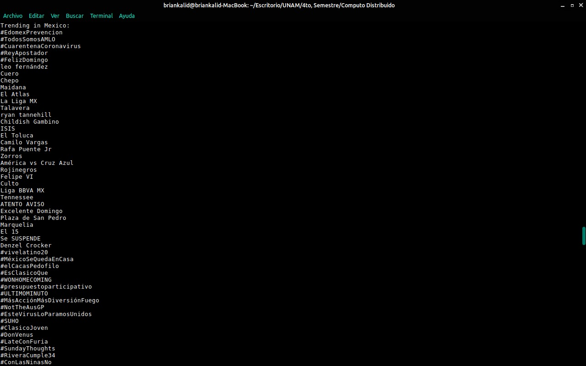
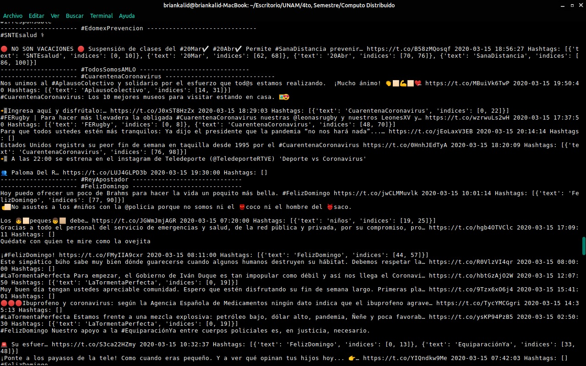

# Analyzing trending tweets and where they came from.
## Report.
###### Distributed Computing project.

Brian Kalid García Olivo and Fernando Nateras Bautista. 
Contact info: briankalid2000@gmail.com and fnaterasb1@gmail.com 
Professor: Víctor De la Luz.

## Project definition.
As our project of distributed computing we are going to work with Twitter to obtain data from the daily trends. 
We want to study the type of tweets that the users are obtaining the news/infomation from, also if the number of followers is a determinant factor for a tweet to go viral. As well we want to study not only the news but the trends in general. Principally we want to study the tweets themselves and see if there is a predominant characteristic of the tweet to go viral.
  
Given the most popular trends we are going to identify the top ones and from them we will locate the most popular tweet or tweets based on the impressions (retweets and likes), so we can know the amount of impressions are nedeed for a tweet to go viral or ve catalogued as popular, we want to know if there is a pattern in the number of impressions and the type of account the has the most popular tweet. Mostly we want to divide the accounts in two, whether if it is verified, like the journalists accounts or the news channels accounts or real news sites, and the other group would be the normal users. Another thing we would like to do is get the localization of these popular tweets to see where these users are tweeting and if the place is an important factor in it. 

## General objectives
  - Get the daily data from Twitter.
  - Locate the most popular trends of the day.
  - Get the most popular tweet or tweets, based mainly in the amount of impressions.
  - Get information from the top tweets.
  - Make the graphs based on the characteristics of the top tweets. 
  - Make this process automatically, and store it in the web.
  
## Software tools
  - Python 3.
  - Twitter API.
  - http server.
  - Text editor.
  - Libraries: tweepy and from this library we also use OAuthHandler and Stream. From tweepy.streaming we used StreamListener the other libraries are twitter, json, datetime, pandas, flask, mysql connectors and matplotlib.
  
## General system architecture.
- Data source : Twitter API.
- Main processing: Pyhton, Tweepy, Json.
- Visualization: Matplotlib and HTML5.
- Web

## Data source.
Our data source is the Twitter API, from there we are going to obtain the necessary data form the daily trends and tweets.

## Instructions, use and tests.
Here we are going to put all the instrucutions for each part of the development (practices) [Instructions](Instructions.md). 
For our first test we have the courrent trends of the day.  
 
  

Next we have the test for obtaining the most popular tweets given the trend.  
 

