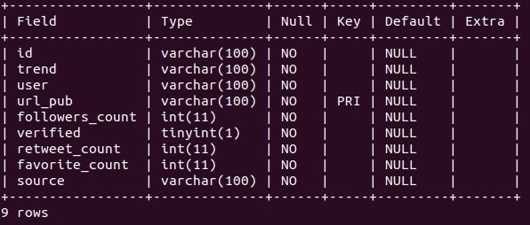

# Analyzing trending tweets and where they came from.
## Report.
###### Distributed Computing project.

Brian Kalid García Olivo and Fernando Nateras Bautista. 
Contact info: briankalid2000@gmail.com and fnaterasb1@gmail.com 
Professor: Víctor De la Luz.

## Project definition.
As our project of distributed computing we are going to work with Twitter to obtain data from the daily trends. 
We want to study the type of tweets that the users are obtaining the news/infomation from, also if the number of followers is a determinant factor for a tweet to go viral. As well we want to study not only the news but the trends in general. Principally we want to study the tweets themselves and see if there is a predominant characteristic of the tweet to go viral.
  
Given the most popular trends we are going to identify the top ones and from them we will locate the most popular tweet or tweets based on the impressions (retweets and likes), so we can know the amount of impressions are nedeed for a tweet to go viral or ve catalogued as popular, we want to know if there is a pattern in the number of impressions and the type of account the has the most popular tweet. Appart from the impressions we also want to know the amount of followers that the account of the tweet has, and see if there is a pattern in the number of followers or if it does not matter at all. Aditionally we want to know the differnt sources of the tweets where they have been tweeted from and from it see if the most popular tweets are coming from desktop computers or mobile devices. 

## General goals
  - Get the daily data from Twitter.
  - Locate the most popular trends of the day.
  - Get the most popular tweet or tweets, based mainly in the amount of impressions.
  - Get information from the top tweets.
  - Make the graphs based on the characteristics of the top tweets. 
  - Make this process automatically, and show it in the web.
  
## Software tools
  - Python3.
  - Twitter API.
  - PHPMyAdmin for the MySQL database.
  - http server.
  - Libraries: tweepy and from this library we also use OAuthHandler and Stream. From tweepy.streaming we used StreamListener the other libraries are twitter, json, datetime, pandas, flask, mysql connectors and matplotlib.
  
## General system architecture.
- **Data source:** Twitter API.
- **Main processing:** Pyhton, Tweepy, Json, Pandas, Numpy, Matplotlib.
- **Visualization:** Matplotlib.
- **Web:** Flask, HTML5, Jinja2.

## Data source.
Our data source is the Twitter API, from there we are going to obtain the necessary data form the daily trends and tweets.

## Instructions and use.
### Install requirements
#### Requires python3 (tested on python 3.8)
- Open a terminal. 
  -  `sudo apt-get install python-dev default-libmysqlclient-dev libssl-dev`.
  -  `pip3 install twitter`
  -  `pip3 install tweepy`
  -  `pip3 install flask`
  -  `pip3 install numpy`
  -  `pip3 install pandas`
  -  `pip3 install matplotlib`
  -  `sudo apt-get install nano`
  -  `pip3 install flask_mysqldb`
  -  `pip3 install mysql-connector`
### Setup
- Open a terminal into folder project.
  -  `nano secret.py`
  -  Insert your keys inside.
  -  `nano db.json.`
  -  Insert your database keys inside.
  -  Save and close.
- Database
  - import [database](Proyecto1.0/database/)(this is in Proyecto1.0/database/), we are going to work with the table "publications" 
  **Table structure** 
  
  #### Use.
  Once you are in the correct directory ("Proyecto1.0") you just have to run it.
  - `/.run.sh -a` to run all modules. 

  Or you can run the 3 modules by separate.
  - `/.run.sh -o` this module gets the data.
  - `/.run.sh -u` this module update the database.
  - `/.run.sh -p` this module processes the data and makes the graphics.
  #### To deploy web service in localhost:
  Once all processes are finished
    -  Run `python3 web.py`
   And you would be able to see the web page
